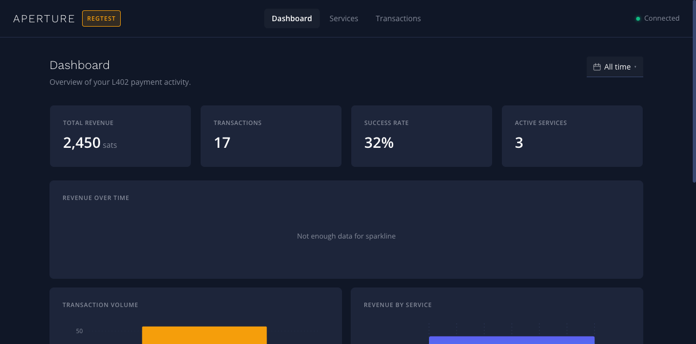
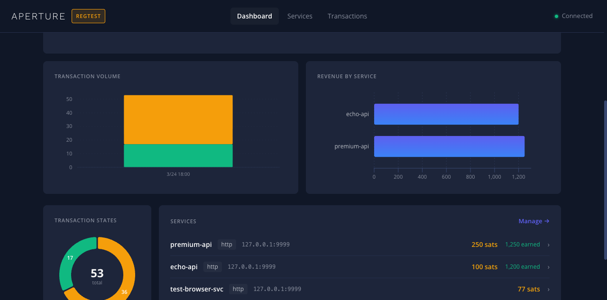
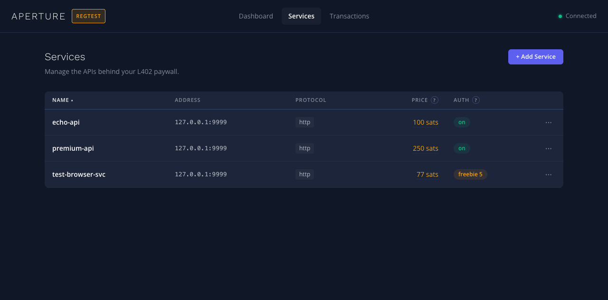
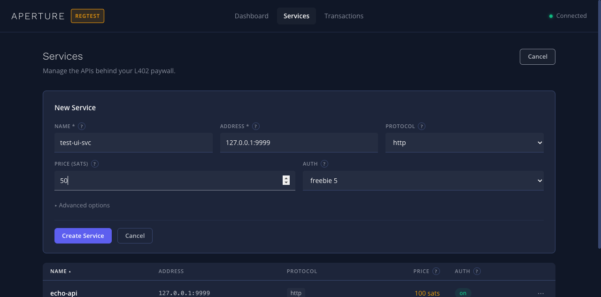
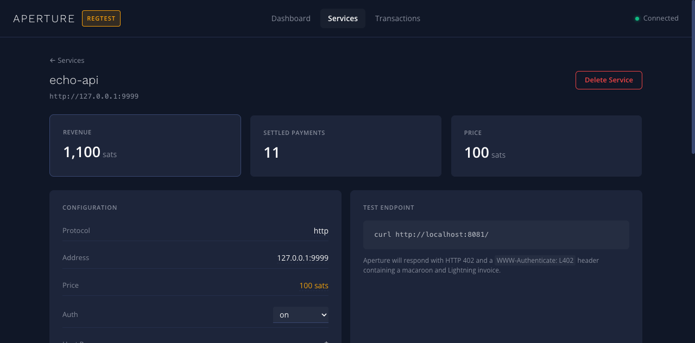
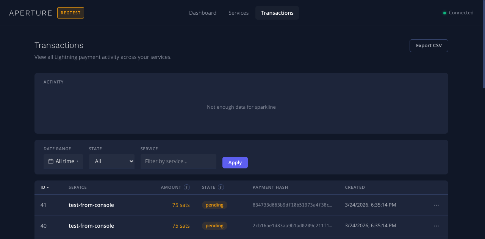

# Dashboard

Aperture includes an embedded web dashboard for monitoring L402 payment
activity, managing proxy services, and viewing transaction history. The
dashboard is a Next.js static export compiled into the Go binary at build
time.

## Building

The dashboard requires a separate build step with the `dashboard` build tag:

```bash
# Build dashboard static export + Go binary with embedded assets
make build-withdashboard

# Or step by step:
cd dashboard && npm ci && npm run build   # produces dashboard/out/
go build -tags=dashboard ./cmd/aperture   # embeds dashboard/out/ via go:embed
```

The default `make build` produces a binary **without** the dashboard. This
means the standard build works without Node.js or npm installed.

## Accessing

When the admin API is enabled (`admin.enabled: true`), the dashboard is served
at the root path of the aperture listen address:

```
http://localhost:8081/
```

The dashboard is a single-page application (SPA) with client-side routing.
All unmatched paths fall through to `index.html` for deep-link support.

## Pages

### Dashboard Home

The main overview page shows key metrics and charts:

- **Stat tiles**: Total Revenue (sats), Transactions, Success Rate, Active Services
- **Revenue Over Time**: Sparkline chart of revenue by hour/day
- **Transaction Volume**: Stacked bar chart showing per-service transaction counts
- **Revenue by Service**: Horizontal bar chart comparing service revenue
- **Transaction States**: Donut chart of settled vs pending transactions
- **Services**: Quick list with prices and revenue earned





### Services

Manage the APIs behind your L402 paywall:

- View all configured services with name, address, protocol, price, and auth level
- Create new services with the "Add Service" form
- Edit service configuration inline
- Delete services via the overflow menu





### Service Detail

Click a service name to view its detail page:

- Revenue and settled payment count for this service
- Full configuration (protocol, address, price, auth, host/path regexps)
- Test endpoint with a ready-to-use curl command
- Recent transactions for this service



### Transactions

View all Lightning payment activity across services:

- **Activity chart**: Sparkline showing transaction volume over time
- **Filters**: Filter by date range, state (pending/settled), or service name
- **Transaction table**: ID, service, amount, state, payment hash, timestamp
- **Export CSV**: Download transaction data for analysis
- **Pagination**: Navigate through large transaction sets



## Architecture

The dashboard uses a server-side proxy pattern for authentication:

```
Browser → /api/proxy/stats
         ↓
[Loopback check]     Must be 127.0.0.1 / ::1
[CSRF check]         X-Requested-With header required on mutations
[Security headers]   X-Frame-Options, CSP, etc.
         ↓
Strip /api/proxy/ prefix → /api/admin/stats
         ↓
Inject admin macaroon header (server-side)
         ↓
Forward to gRPC gateway → admin gRPC server
         ↓
Response returned to browser
```

This means:

- **No client-side credentials**: The browser never sees or stores the admin
  macaroon. Authentication is handled server-side by the proxy.
- **Loopback only**: The dashboard proxy only accepts requests from
  `127.0.0.1` or `::1`. It cannot be accessed from remote machines.
- **CSRF protection**: Mutating requests (POST, PUT, DELETE) require the
  `X-Requested-With` header, which cannot be set by simple cross-origin
  requests (form posts, img tags).
- **Security headers**: Every dashboard response includes `X-Frame-Options:
  DENY`, `Content-Security-Policy`, `X-Content-Type-Options: nosniff`, and
  `Referrer-Policy`.

## Data Refresh

The dashboard uses SWR (stale-while-revalidate) for data fetching:

| Data | Refresh interval |
|------|-----------------|
| Stats | 30 seconds |
| Services | 30 seconds |
| Transactions | 30 seconds |
| Info | 60 seconds |

Data refreshes automatically in the background. Mutations (create, update,
delete) trigger immediate cache revalidation.

## Configuration

The dashboard is configured entirely through the `admin` section of
`aperture.yaml`:

```yaml
admin:
  enabled: true
  macaroonpath: "/path/to/admin.macaroon"
  corsorigin:
    - "http://localhost:3000"
```

No additional dashboard-specific configuration is needed. The dashboard
automatically detects the network (mainnet, testnet, regtest) and displays
it as a badge in the navigation bar.

## Development

To work on the dashboard UI during development:

```bash
cd dashboard
npm ci
npm run dev    # Start Next.js dev server on :3000
```

The dev server expects the aperture admin API to be running at
`localhost:8081`. Edit `dashboard/next.config.ts` to adjust the proxy target
if needed.

### Tech Stack

- **Next.js 16** with static export (`output: 'export'`)
- **React 19** with Emotion CSS-in-JS
- **SWR** for data fetching with automatic revalidation
- **@visx** for charts (bar, area, pie)
- **TypeScript** with strict mode
